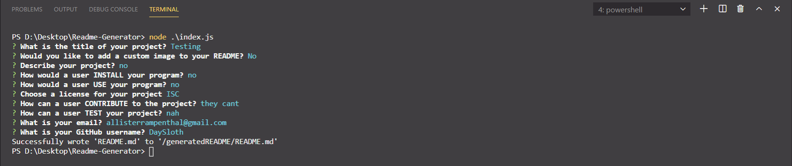
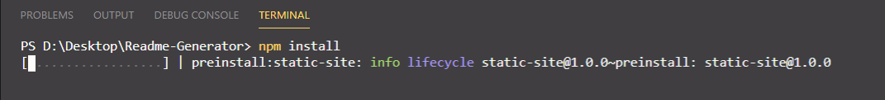
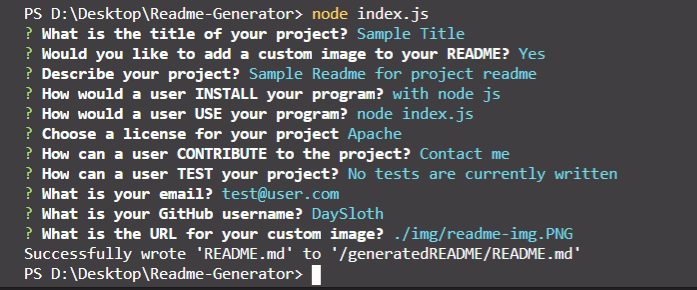

# Professional Readme Generator




## Description 

This project was built for devs who would like a quick way to generate a README for their project. If you are like me you are not a huge fan at writing markdown, this application solves just that problem.

## Usage

You will need to have [NodeJS](https://nodejs.org/en/) installed on your machine to run this code. Once this is done open up the index.js in terminal and type:

```
npm install
```


This will install all of the required dependencies. Then you can proceed with: 

```
node index.js
```


This will take you through prompts to generate a well written readme. You will have the option to input a custom image URL as well. If you don't want one AT ALL you will have to just delete the image markdown in the generated readme.

## Credits

Website is built with Node JS

## License

Copyright (c) Allister Rampenthal. All rights reserved.

Licensed under the [MIT](https://choosealicense.com/licenses/mit/) license